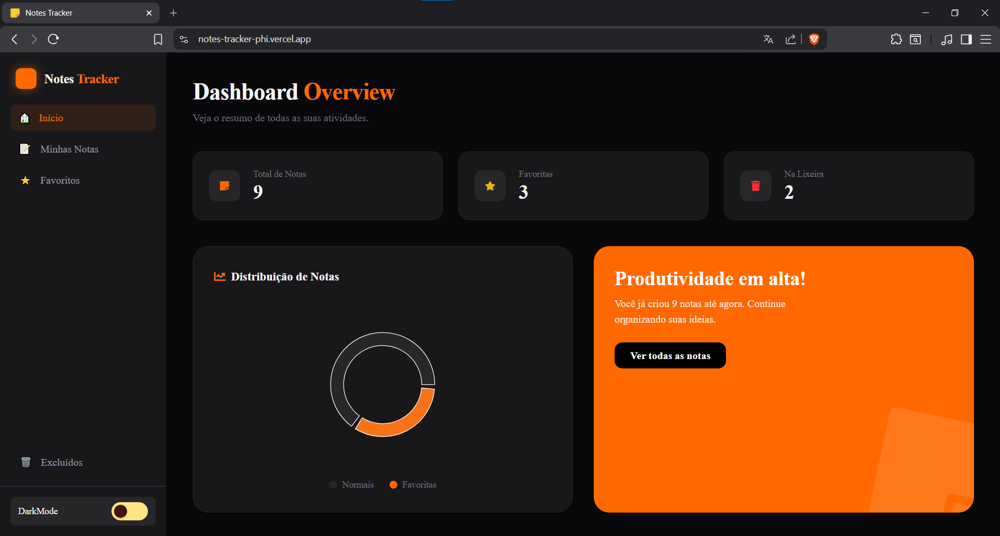

# 📝 Notes Tracker - Dashboard de Produtividade

Este é um gerenciador de notas moderno e intuitivo, focado em organização pessoal e produtividade. O projeto apresenta um dashboard completo com estatísticas em tempo real, sistema de favoritos e lixeira.

## 🚀 Funcionalidades

- **Dashboard Overview**: Visualização rápida do total de notas, favoritas e excluídas.
- **Gráficos Dinâmicos**: Distribuição de notas visualizada através de um gráfico de pizza interativo.
- **Gestão de Notas**: Criar, favoritar e mover notas para a lixeira.
- **Dark Mode**: Interface totalmente adaptável ao tema claro ou escuro.
- **Responsividade**: Experiência otimizada para dispositivos móveis e desktop.

## 🛠️ Tecnologias Utilizadas

- **React** (Vite)
- **TypeScript**
- **Tailwind CSS** (Estilização e Responsividade)
- **Lucide React / React Icons** (Iconografia)
- **Recharts** (Visualização de dados)
- **React Router Dom** (Navegação)
- **Context API** (Gerenciamento de estado global)

## 🏗️ Arquitetura e Conceitos Aplicados

Neste projeto, apliquei conceitos fundamentais de desenvolvimento web moderno:

- **Gerenciamento de Estado**: Uso de Context API para compartilhar dados entre componentes sem Prop Drilling.
- **Mobile First**: Design pensado primeiramente para dispositivos móveis antes da adaptação para telas maiores.
- **Clean Code**: Componentização e organização de pastas seguindo boas práticas.

## 🔗 Link do Projeto

O projeto está publicado e pode ser acessado através do link abaixo:

> **Acesse aqui:** [Notes Tracker Online](https://notes-tracker-phi.vercel.app/)
